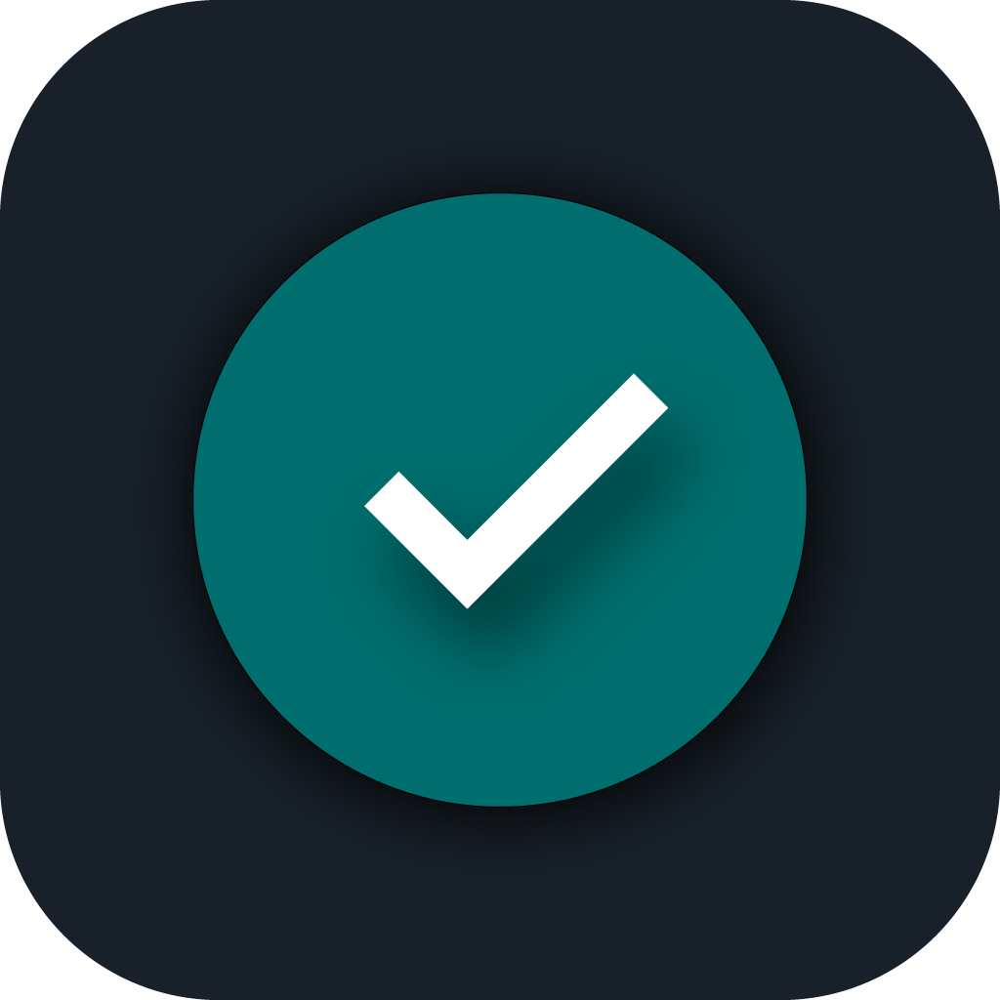
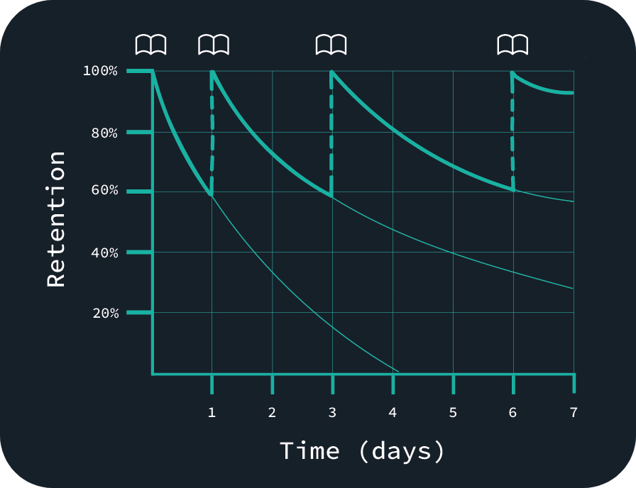
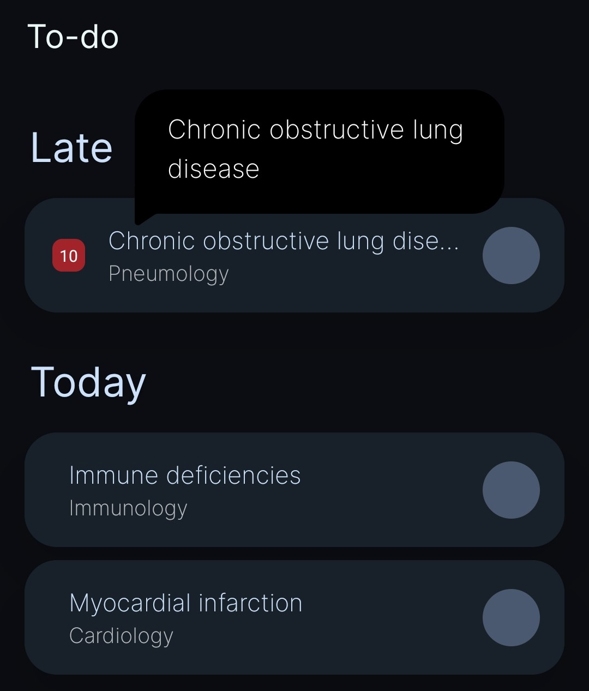
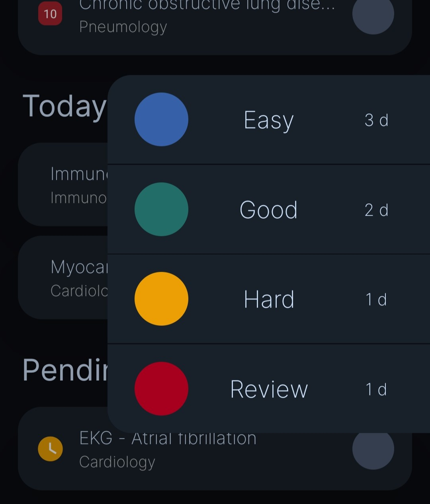
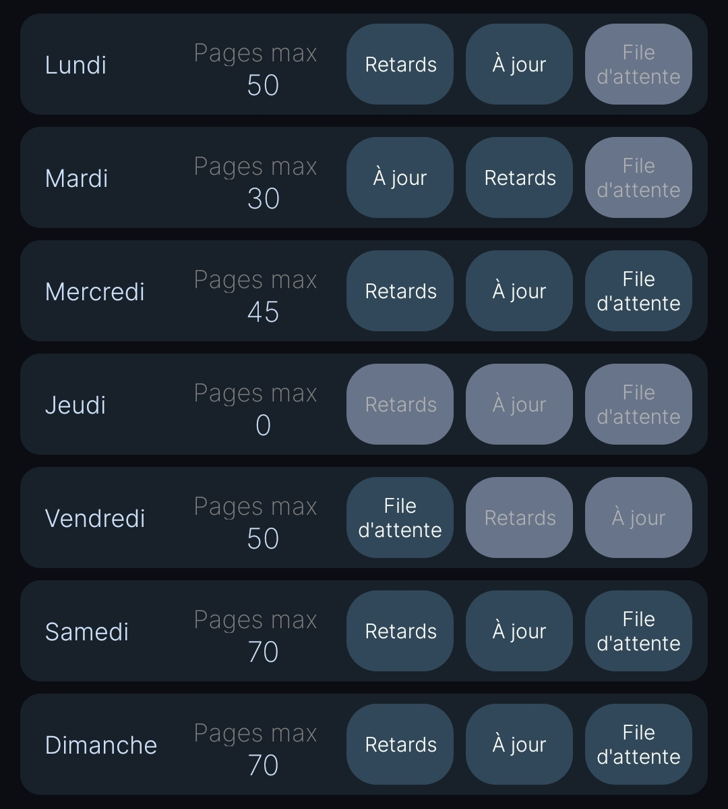
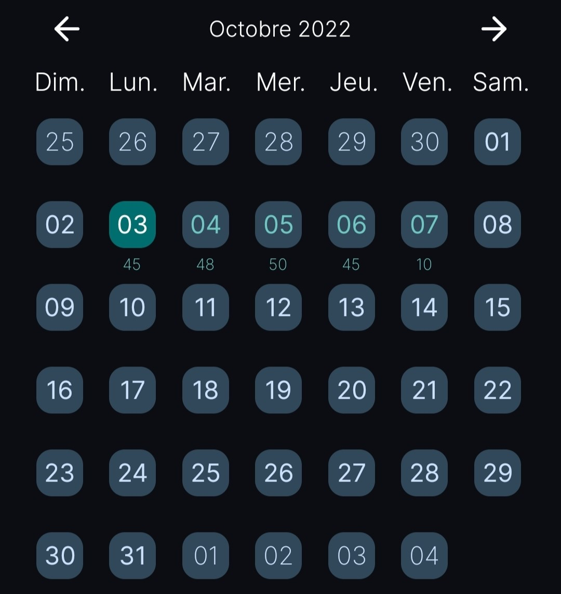
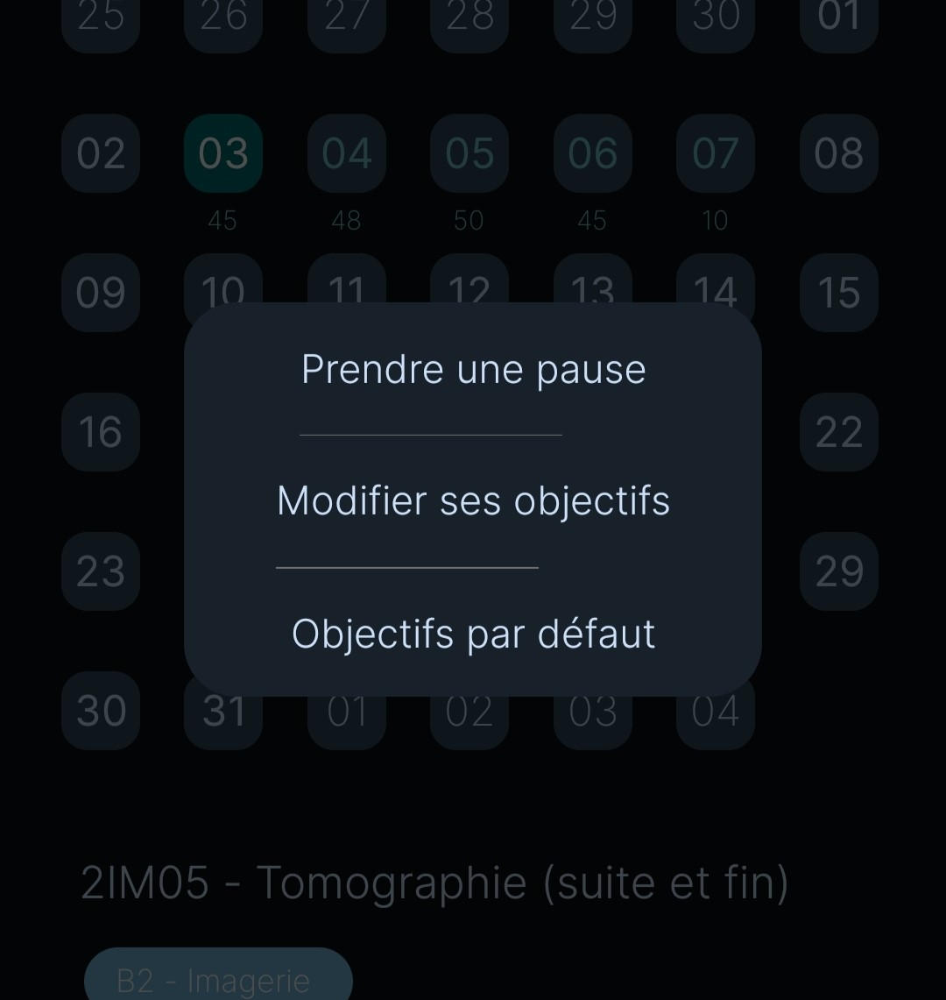
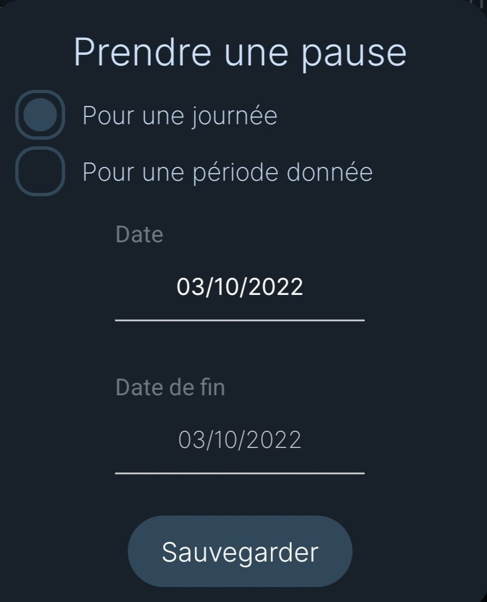
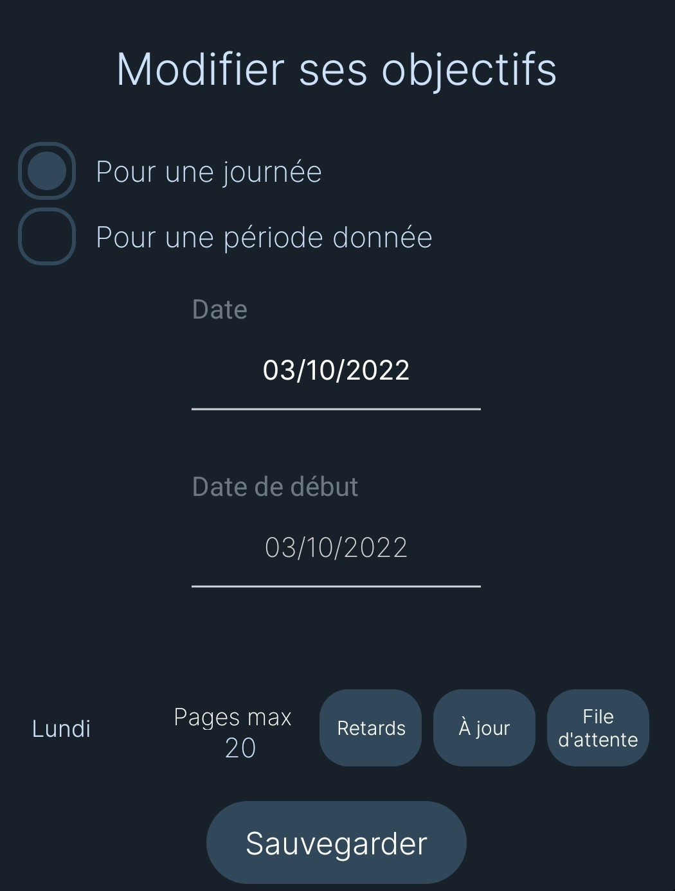
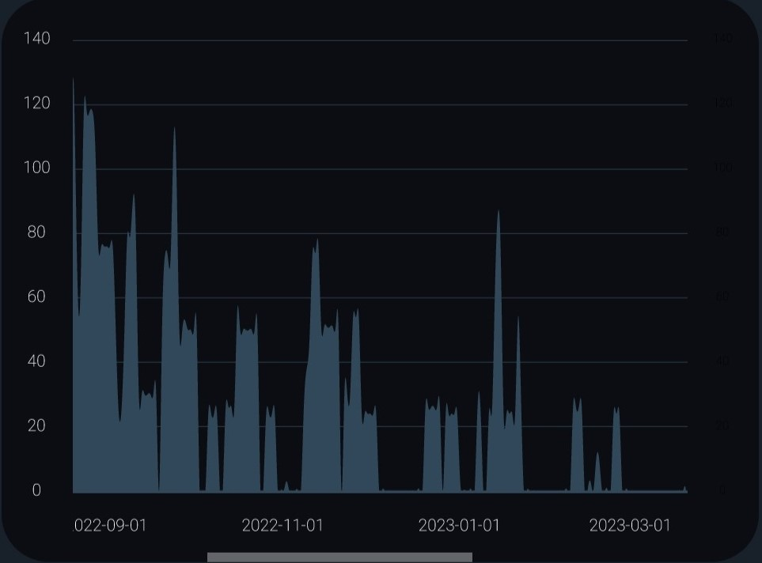

# Bienvenue sur Stude Docs !

> Stude Docs rassemble toutes les informations dont vous aurez besoin pour exploiter pleinement Stude ! 🎉
  En cas de question ou de suggestion, vous pouvez me contacter par e-mail à l'adresse support@stude.app ✉️

    
    

        
           
    

  

# Pour qui ?

L'application Stude est parfaite pour les étudiants qui ne veulent pas oublier ce qu'ils apprennent au cours de l'année, mais ne savent pas comment réviser régulièrement sans se surcharger. Elle permet ainsi de garder un équilibre entre vie scolaire et vie personnelle ⚖️

> L'application est super flexible, et c'est la raison pour laquelle cette documentation existe. Accroche-toi, ça vaut le coup ✌️

# Comment ça marche ?

Stude utilise le principe de la répétition espacée pour te proposer chaque jour une To-do list des chapitres que te devrais réviser 🕐
  L'application prend en compte tes capacités (en nombre de pages) pour que tes révisions soient efficaces et régulières, le tout sans te surcharger !

> Stude diffère de la méthode des J car tu peux lui spécifier la difficulté d'une révision, et l'application adaptera les intervalles de répétition en fonction !

 

# Utilisation classique

Dans la vie de tous les jours, ouvre Stude, révise les chapitres qui sont notés, puis coche-les en sélectionnant la difficulté de l'item. Une fois que c'est fait, tu peux quitter l'application et Stude recalculera une nouvelle To-do list le lendemain.

    
    

> En fonction de la difficulté du chapitre, de tes préférences de révisions, de l'importance de la matière et de tes disponibilités, Stude calculera automatiquement l'intervalle idéal avant la prochaine révision !

# Ajouter un nouveau chapitre

 Pour créer une To-do list, il faut des chapitres, voyons donc comment en ajouter !

## Sur le tas

> Imaginons que tu viennes de découvrir un nouveau cours et que tu aimerais l'apprendre aujourd'hui. Tu appuies sur le +, tu remplis tous les champs, tu peux choisir les tags qui t'intéressent (voir [Exploiter les tags à leur maximum](<?id=exploiter-les-tags-à-leur-maximum>)) puis valider.
 Enfin, tu apprends le chapitre en question et tu peux le cocher, tout simplement !

## En utilisant les files d'attente

Prenons un exemple de la vie de tous les jours : on est vendredi (et tu as défini 70 pages maximum pour ce jour), tu ouvres l'application et tu vois tous les chapitres que tu dois réviser. Sauf qu'aujourd'hui tu n'as pas beaucoup de choses à réviser, donc ça te fait un total de 30 pages à travailler sur 70.
 Eh bien Stude te propose de définir des files d'attente de nouveaux chapitres à découvrir ! Imaginons que tu aies un livre que tu aimerais apprendre, tu peux très bien ajouter tous les chapitres de ce livre dans une file d'attente. Ensuite, chaque fois que tu n'auras pas saturé tes capacités maximum, Stude pourra piocher dans cette file d'attente pour te pousser à avancer 📈

> Pour cela il te suffit, juste avant de valider l'ajout d'un chapitre, de cocher la case "Ajouter dans une file d'attente" et de sélectionner la file d'attente qui t'intéresse (voir <a href='#/?id=créer-une-file-d39attente'>Créer une file d'attente</a>).
 Félicitations, tu viens d'ajouter ton premier chapitre en file d'attente ;)

# Exploiter les tags à leur maximum

> Les tags sont non seulement un moyen d'organiser tes cours (selon la matière, par exemple), mais ils te permettent aussi d'optimiser au maximum tes révisions !

## Créer un tag

Pour créer un tag, tu peux ouvrir la liste des tags (bouton "Tags"), puis appuyer sur le + en haut à droite de la fenêtre. Ensuite, choisis un nom, une jolie couleur pour ton tag, et définis l'importance de la matière représentée par ton tag. Tu peux ensuite sauvegarder 🎉
> Une matière importante sera révisée plus fréquemment, et inversement (pratique pour prioriser ses cours !)
 

## Utiliser les tags

Maintenant que c'est fait, tu vas pouvoir utiliser les tags dans une situation concrète. Ouvre le menu d'ajout de chapitre, puis le menu des tags. Tu peux alors sélectionner ton tag.

> Note importante : tu peux sélectionner plusieurs tags pour un même chapitre, mais tu pourras seulement choisir un tag comme tag principal (avec la petite étoile ⭐).

Maintenant que tu as choisi un ou plusieurs tags pour ton chapitre, tu peux te retrouver plus facilement dans tes cours dans l'onglet "Mes items" 🎉

## Pourquoi un tag principal ?

Tu te rappelles, lors de la création d'un tag, on avait un petit curseur pour indiquer l'importance de la matière associée. Maintenant, si on associe plusieurs tags à un même chapitre, quel paramètre prendre en compte ? La réponse est évidente : en définissant un tag principal !
 Une fois un tag principal choisi pour ton chapitre, un nouveau menu d'options devient accessible pour ton chapitre, et tu peux y accéder via le bouton 💡

> Dans ce menu, tu auras deux options :
> <ul>
>     <li>Le type d'étude (voir <a href='#/?id=définir-son-style-d39apprentissage'>Définir son style d'apprentissage</a>) : pré-rempli selon tes paramètres généraux, mais tu peux toujours le personnaliser selon chaque chapitre</li>
>     <li>L'importance du chapitre : cette fois-ci pré-rempli selon ton tag principal, tu peux également le personnaliser selon chaque chapitre</li>
> </ul>
>  Grâce à ces options, tu pourras optimiser à 100% (voire un peu plus) tes révisions, en concentrant tes efforts sur les chapitres qui en valent la peine 💡

# Maîtriser les files d'attente

> Les files d'attente te permettent de te pousser à découvrir de nouveaux chapitres lorsque tu as peu de révisions de prévues 📈

## Créer une file d'attente

> Tu peux aller dans l'onglet "Mes items" et appuyer sur l'icône 📚. En appuyant sur +, tu peux créer une file d'attente !

## Ajouter un chapitre

> Voir [Ajouter un item en utilisant les files d'attente](<?id=en-utilisant-les-files-d39attente>)

## Gérer ses files d'attente

> Une fois tes chapitres ajoutés dans la file d'attente de ton choix, tu peux ouvrir cette dernière, et réorganiser tes chapitres dans l'ordre dans lequel tu souhaites les découvrir ! Pour cela, appuie sur les 2 traits à gauche du nom du chapitre et glisse-le pour modifier l'ordre ↕️
 Une fois ta file d'attente prête, tu peux l'activer ou la désactiver avec l'interrupteur dédié 🎉

# Archiver un chapitre

> Une fois qu'un chapitre ne t'intéresse plus (parce que les examens sont passés par exemple), tu peux vouloir le supprimer, ou bien si tu veux te laisser la possibilité d'y retourner sans qu'il ne pollue tes To-do lists, tu peux l'**archiver**.
 Une fois archivé, tu garderas la possibilité de restaurer le chapitre !

# Associer des fichiers

De nos jours, il est devenu courant d'avoir des fichiers numériques associés à ses cours : un diaporama, un document, une vidéo... Et on a parfois pas envie de fouiller dans ses fichiers pour retrouver le document d'intérêt, surtout sur un téléphone ou une tablette, pas vrai ?
 Alors pourquoi ne pas associer tous les documents dont tu as besoin à ta to-do list ? 

> Avec Stude, c'est facile à faire ! Appuie sur un chapitre, choisis "Ouvrir les fichiers et notes associés". Tu peux appuyer sur le + en haut à droite et choisir un fichier depuis le stockage de ton téléphone.
 C'est tout ! Tu peux désormais y accéder en appuyant sur le 📖 à côté du nom du fichier, et tu n'as plus besoin de porter 3 classeurs pour aller à la bilbiothèque 😎
  <i>Petite astuce pour les utilisateurs de tablette Android : tu peux utiliser Xodo comme application d'annotation de PDF. Cela te permettra d'annoter et de sauvegarder automatiquement tes fichiers, sans que tu n'aies à te soucier de quoi que ce soit </i>🎉  

 🚨 *Attention* 🚨 *Ces fichiers sont stockés localement, et ne seront pas synchronisés entre tes appareils, même si tu utilises Stude + ! Pense donc à bien réfléchir à l'appareil sur lequel tu veux associer tes fichiers ✅ Tu peux par exemple utiliser ton téléphone pour avoir ta to-do list sur toi en permanence, et stocker les fichiers sur tablette pour un confort de lecture optimal.*

# Associer des notes

En plus de pouvoir associer des fichiers, tu peux également associer de courtes notes à chacun de tes chapitres 📝 Toujours utile pour noter quelques points essentiels à retenir !

> Ces notes sont bien synchronisées entre tes appareils si tu utilises Stude + ✅

# Booster sa productivité avec Stude +

> Tu commences à avoir une bibliothèque de chapitres bien remplie et tu as peur de perdre tes données ? Stude + est fait pour toi !
> Adapté aux bourses étudiantes, pour seulement <b>1.99€ par mois</b>, tu débloques de nouvelles fonctionnalités !
> <ul>
>    <li>Tes chapitres, les notes associées, tes données de révisions, tes paramètres, tout sera sauvegardé en ligne de manière sécurisée 🔒</li>
>    <li>Tes données seront synchronisées entre tes appareils, pratique pour étudier sur tablette ! ✅</li>
>    <li>Il n'y aura plus de publicités 🚫</li>
>    <li>Et en plus de tout ça, tu soutiens le développeur 🤟</li>
></ul>
><i>Rappel : les fichiers associés ne sont pas synchronisés ni sauvegardés en ligne, seulement localement.</i>

# Paramètres généraux de Stude

Tu peux y accéder à partir du dernier onglet "Mon profil", en appuyant sur ⚙️.

## Définir son style d'apprentissage

> Est-ce que tu préfères lire tes cours sans te forcer à apprendre, mais régulièrement ? Ou au contraire, tu préfères travailler tes cours moins souvent, mais en t'efforçant de tout retenir jusque dans les moindres détails ? Un mélange des deux ? Stude s'adapte à ton style !
 Dans les paramètres, tu trouveras une option pour sélectionner ta manière d'étudier ✅

## Définir ses capacités

> Grâce à Stude, tu peux définir tes capacités au cours de la semaine, parce que tu n'as pas forcément le temps de travailler 150 pages par jour, voire de travailler tout court certains jours 💤
> En allant dans les paramètres de Stude, tu auras accès à un tableau représentant les différents jours de la semaine.
>

>    
>

> 
>    <a style='color: grey; width: 50%; text-align: center;'>
>        À chaque jour de la semaine est associé un objectif de pages à réviser. Mais ce n'est pas tout, tu peux aussi choisir quel type de révisions tu souhaiterais faire en priorité : rattraper ton retard, voir des chapitres à jour, ou encore découvrir de nouveaux chapitres en file d'attente !
>         Tu peux activer / désactiver chacune des boîtes associées en appuyant dessus, ou encore changer l'ordre de priorité en glissant / déposant ces dernières.
>    </a>

# Prendre une pause / modifier ses objectifs

> Il arrive qu'on n'ait pas le temps de travailler certains jours, ou simplement qu'on ait envie de prendre des vacances. Stude peut prendre cela en compte et s'adapter à tes changements de disponibilités même à la dernière minute ! Pour cela, il faut aller dans l'onglet Calendrier de Stude, dans lequel tu as un aperçu de ce que tu dois réviser dans les prochains jours ✅

    
    

> Dans cet exemple, on va prendre une pause le 3 octobre : on fait un appui long sur la date concernée. Un menu s'affiche avec plusieurs options, on pourra alors choisir de :
>

>    

>        <h1>Prendre une pause</h1>
>        

>            
>        

>    

>    

>        <h1>Modifier ses objectifs</h1>
>        

>            
>        

>   

>     
>

# Trouver ses paramètres idéaux

> Tu as entré plein de nouveaux chapitres, tu as des files d'attente pleines à craquer, et tu te demandes si les capacités que tu as définies sont suffisantes ? Pas de panique ! Stude te permet de simuler le retard que tu auras sur tes cours ✅
 Il te suffit d'aller dans les paramètres de Stude, et d'ouvrir le simulateur. Une fois que c'est fait, tu peux lancer une simulation et voilà, tu obtiens une belle courbe !

    

 Maintenant, comment l'interpréter ? Cette courbe représente le nombre de pages en retard par rapport à ce que l'algorithme de répétition espacée a calculé. Attention, avoir du retard n'est pas dramatique, tu en auras forcément en lançant une simulation ! Etant donné que Stude limite le nombre de pages par jour en fonction de tes capacités, certains chapitres seront reportés au lendemain sans que tu ne t'en rendes compte, et ça, c'est du retard techniquement parlant ;)

> Ce qu'il faut évaluer n'est pas la quantité de retard, mais <b>la tendance du retard</b> :
><ul>
><li><b>Soit tu n'as quasiment pas de retard, ou bien celui-ci se résorbe</b> : Félicitations ! Tes paramètres sont amplement suffisants ✅</li>
><li><b>Soit le retard est existant, mais stable</b> : Tes paramètres sont également suffisants ✅</li>
><li><b>Soit le retard ne fait que s'accumuler, sans jamais diminuer</b> : Attention ! Il va falloir penser à augmenter la cadence dans tes paramètres ❌</li>
></ul>

